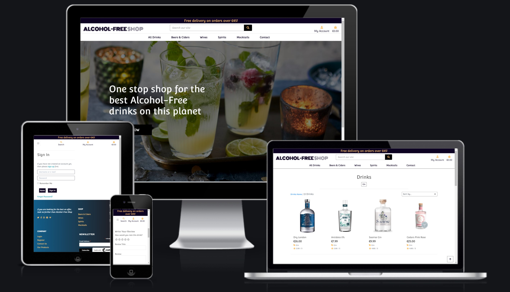
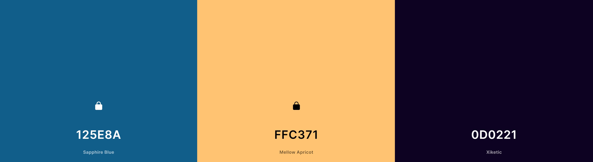
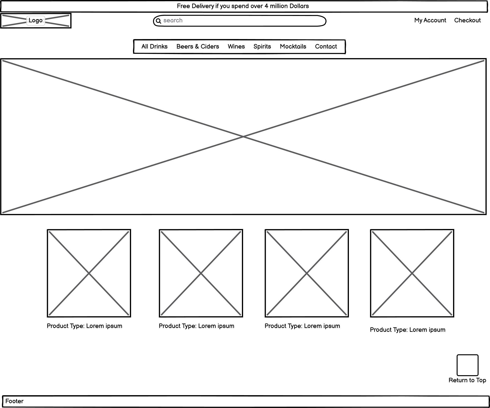
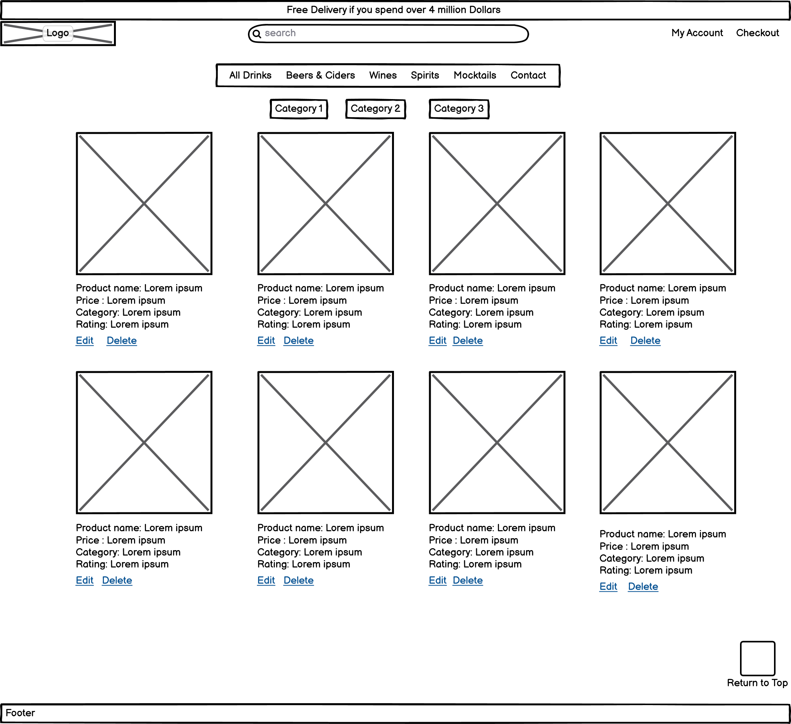
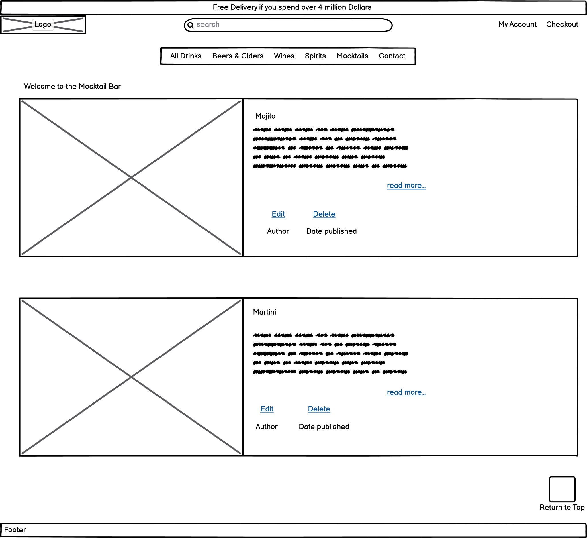
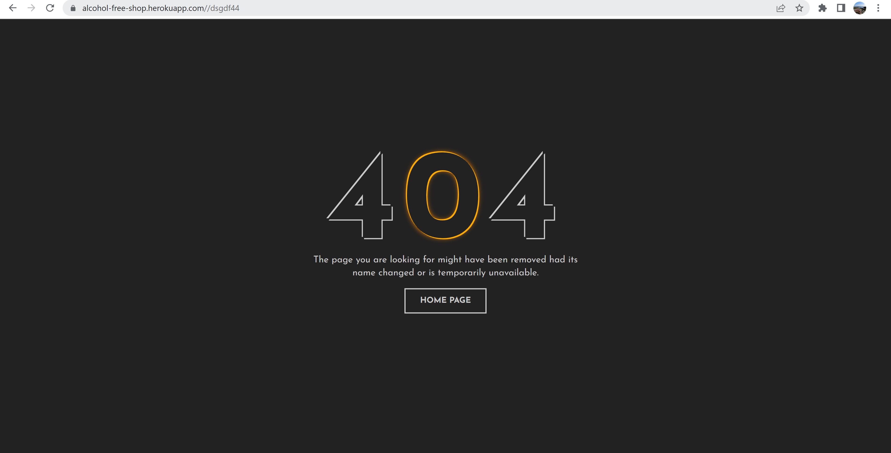
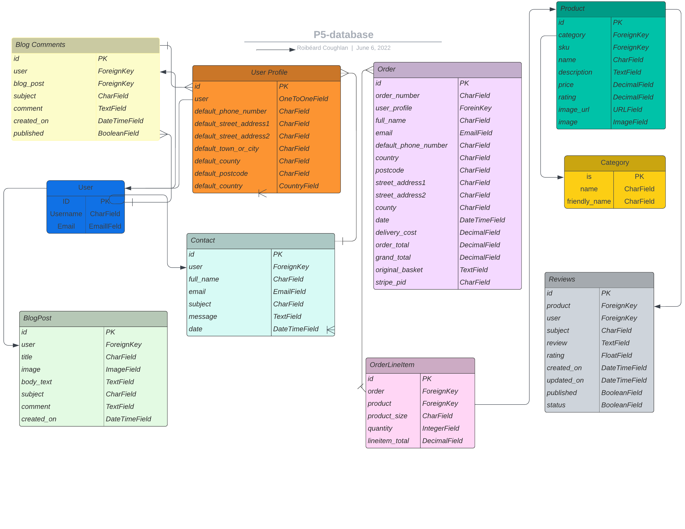

# The Alcohol Free Shop
**The Alcohol Free Shop** is an ecommerce website for users looking to purchase Alcohol-Free drinks. It gives great value to the user where they can rate & review a product that they have used & also read other users reviews. They can also gain value from interacting on the Mocktail blog page, which gives tips on making high quality Mocktails(including nutritional value). This was developed for education purposes. It is a fully functioning ecommerce Project developed as part of my- Diploma in Software Development (Full stack) with [Code Institute](https://codeinstitute.net/ie/).
 
 

## About

Link to [live site](https://alcohol-free-shop.roibeardruadhan.com)

## **Contents**

- [**UX (User Experience)**](#ux-user-experience)
  - [**User Stories**](#user-stories)
  - [**Site Owner Goals**](#site-owner-goals)
- [**Scope Plan**](#scope-plan)
  - [**Fonts**](#fonts)
  - [**Colours**](#colours)
  - [**Imagery**](#imagery)
  - [**Wireframes**](#wireframes)
- [**Technologies**](#technologies)
  - [**Languages**](#languages)
  - [**Database**](#database)
  - [**Libraries**](#libraries)
  - [**Tools**](#tools)
- [**Scope Plan**](#scope-plan)
  - [****Existing Features****](#existing-features)
  - [**Future Features**](#future-features)
- [**Version Control**](#version-control)
- [**Testing**](#testing)
- [**Deployment**](#deployment)
  - [**Running Locally**](#running-locally)
- [**Credits**](#credits)
  - [**Images**](#images)
  - [**Acknowledgements**](#acknowledgements)
  

### **User Stories**
### User Stories

- As a first time visitor:
    * I want to easily navigate throughout the site.
    * I want to understand the purpose of the site easily so that I can see what is offers me.
    * I expect an attractive layout & welcoming design that contributes to my experience.
    * I want the site to be accessible.
    * I want the site to be responsive across all devices.

- As an unregistered visitor:
    * I want to be able to search and filter products easily and efficiently.
    * I want to be able to sort and view products according to type, price and name.
    * I want to be able to be able to view product detail so I can find information about price, size and description.
    * I want to be able to read reviews from previous users of the product.
    * I want to be able to add products to my shopping bag.
    * I want to be able to view my shopping bag.
    * I want to be able to edit my shopping bag.
    * I want to be able to view the total cost of my bag.
    * I want to be able to complete the checkout process and be able to enter payment information easily.
    * I want to be able to view a confirmation of my order once the checkout process is complete.
    * I want to be able to received an email confirmation of my order.
    * I want to be able to register easily for an account.
    * I want to be able to access the Mocktail page & read the comments.
    * I want to be able to see instructions appear to notify me if I have succeeded in my intention of purchasing a product etc.
    * I want to be able to send a message to the company if I have any queries

- As a registered visitor:
    * I want to be able to receive a confirmation email upon registration.
    * I want to be able to view my personalised profile.
    * I want to be able to save and edit personal information on my profile.
    * I want to be able to view my order history.
    * I want to be able to login an logout with ease.
    * I want to be able to leave reviews on products.
    * I want to be able to edit or delete my reviews.
    * I want to be able to leave comments on the blog posts.
    * I want to be able to edit or delete comments on blog posts.
    * I want to be able to leaves reviews under the products I have tested.
    * I want to be able to edit or delete my reviews on products.
    * I want to be able to delete my account.
    * I want to be able to change my password to keep my account secure.
    * I want to be able to reset my password if I forget it.
    * I want to be able to see instructions appear to notify me if I have succeeded in posting a comment or review etc.

- As a returning visitor:
    * I want to be able to find social media links.
    * I want to be able to contact the site owner if I have any queries.
    * I want to enjoy using the site without never ending scrolling.
    * I want to be able update or delete any comments or reviews I made.

- As a superuser:
    * I want to be able to add new products.
    * I want to be able to edit or delete existing products.
    * I want to be able to add new categories.
    * I want to be able to edit or delete existing blog posts.
    * I want to be able to edit or delete blog comments left by users. 
    * I want to be able to delete or edit user reviews left on products.
    * I want to be able to access the Django admin portal easily
    * I want to be able to delete a user.
    * I want to be able to make another user admin.
    * I want to be able to add a new Mocktail blog via the browser when logged in or in the admin.
 

#### **Site Owner Goals** 
* To build a fully functioning eCommerce webpage that brings value to the userS


[Back to contents](#contents)


## **Scope-Plan**

### **Existing Features**

During the initial strategy planning, the opportunities of the site were determined and values were given according to their imporance and viability ranking between 1 and 5. Below are the list of features that were valued important and viable at this stage.

#### Design
- Responsive design
- Easy navigation throughout, nav links clearly labelled or icons used in navbar. Sidenav used for smaller devices.
- Site logo - returns user to the home page
- Links will change or be removed depending on the status of the User.
- The ability for users to review the product so that they can share this with non users & users alike
- The ability to write more than one comment for a user in the Mocktail blog to discuss aspects which will be further developed in the future. 
- Having no likes on the comments was also a personal preference.
- A stylish modern yet simple look
- Give users a nice way to rate there products by simply clicking on the amount of stars they rate it by.

#### Products
- Users are able to search and filter products depending on what they are looking for
- Users can add products to shopping bag
- Users can update or delete products from shopping bag
- Users can securely purchase product(s) from the site
- Order confirmation will be displayed to user and subsequent confirmation email sent.
- Registered users can leave reviews on products
- Registered users can edit or delete their reviews
- Users can rate products they have test but only one review per product.

#### Register, Login and Logout
- Users are able to register for an account
- Registered users can update there account with any new details when required 
- Registered users can login and logout of account
- Users will receive confirmation emails for registering, order summary and contact enquiries.
- Registered users can change their password if forgotten
- Registered users can view profile containing personal information and order history


#### Admin
- Admin users can add, update and delete products
- Admin users can create new categories
- Admin users can add, update and delete blog posts
- Admin users can delete user comments on blog posts
- Admin users can delete user reviews on products
- Admin users can delete users
- Admin users can make other users admin

#### Other
- Users can contact site owner through contact form
- If user is logged in, contact form will pre-populate
- Social media links displayed
- Back to top button in footer, to prevent unnecessary scrolling
- All users can view blog posts, if logged in users can leave comments
- Deletion confirmation before anything is deleted, to prevent accidental deletion
- Cancel buttons on all edit pages, incase user changes their mind
- A non user can make a purchase without intially having an account by adding there details in the checkout.


### **Features Left to Implement**

- A user can respond to comments directly underneath like on social media to raise a discussion atmosphere
- When the user rates the product it should move the average of the current ranking.
- Expand further product lines and markets
- To have a more details on the ABV(alcohol by volumn) per product.
- To have more detail on the origin of the product particularly with wine.
- Out of stock notifications on product detail when a product had run out
- Add an option to purchase a 12/24 pack of drinks etc which would entail a reduced price.
- Add a more recipe styled Mocktail format to make more appealing visually & easier to apply.


### **Fonts**

The logo was designed by simply using the font [Monoton](https://fonts.google.com/specimen/Monoton) via [Google Fonts](https://fonts.google.com/). When the font weight is set below a certain number it added the effect I was looking for.
For the rest of the project I used [Convergence](https://fonts.google.com/specimen/Convergence) which brings the subtlety of a bar atmosphere


### **Colours**

I originally started with Saphire Blue color as pointed out below & tested it with various colours on [coolors](https://coolors.co/).

 
 After several tests I decided to go with Mellow Apricot as I felt it complimented both Saphire Blue along with Xiketic. 

 

### **Imagery**

All the product images were sourced using google images, right clicking & saving image as(Educational Purposes Only noted in footer). When I had received the images I was able to edit the size(assist alignment), graphic formats to png & reduce the capacity using [Bulkresizephoto's](https://bulkresizephotos.com/en). All you need to do is drag & drop, pick your preferred transition options & the images will land in your downloads folder wrappeed. Unwrap the images & transfer them onto gitpod. When they are on gitpod & tested on the browser they can now be sent to AWS S3 bucket & stored in the backend. This should continue to function as long as there are no changes to the name on the frontend.  

- The home page hero image is darkened using linear-gradient to 
- No image was required for the logo as it was completed using the Monoton font, when set a certain font weight, with one word(shop) inside a 'strong' tag, it gives a design affect.
- The images in the Mocktail blog page were sourced from [MakemineaMocktail.com](https://makemineamocktail.com/).

### **Wireframes**

- Desktop view
* The home page wireframe below was going to impliment cards for each product category but this would not add much value in terms of real world use case. Most people are aware of drink categories & do not need a small image & brief desciption of each.
    
* The products page stayed with the original wireframe. There was a lot of consideration into adding a banner image in the background of the nav bar but I found this did not add any proffessional value.
    
* The Mocktail blog page has change in some minor areas, mainly in styling & the pagination implimentation.
    


[Back to contents](#contents)


## **Technologies**

- [Django](https://www.djangoproject.com) - Framework used.
- [Am I Responsive?](http://ami.responsivedesign.is/) was used to create the mock ups.
- [Stripe](https://stripe.com/) - Used for adding payment functionality.
- [AWS](https://aws.amazon.com/) - Used for hosting static and media files.
- [Balsamiq](https://balsamiq.com) – Used for creating the wireframes.
- [Heroku](https://signup.heroku.com/) - Where the live site is deployed.
- [Bootstrap 4](https://getbootstrap.com) - Bootstrap grid system, utility classes, nav-bar, toasts, cards, badges and tables.
- [Django Crispy Forms](https://django-crispy-forms.readthedocs.io/en/latest/) - Used for rendering forms.
- [Fontawesome](https://fontawesome.com/) - Used for icons.
- [Google Fonts](https://fonts.google.com) - The 2 fonts used throughout the website are from Google fonts.
- [Git](https://git-scm.com/) - Used for version control.
- [GitHub](https://github.com) - Used to store the project repository.
- [Gitpod IDE](https://www.gitpod.io/) - Development environment where the site was built.
- [Gimp 2.1](https://www.gimp.org/) - Used for editing, scaling images.
- [icons8](https://icons8.com) - Used for creating a favicon.
- [Bulkresizephoto's](https://bulkresizephotos.com/en) - Used for compressing & transering images to png.
- [Chrome Dev Tools](https://developers.google.com/web/tools/chrome-devtools) - Used throughout the development of the website to quickly see changes, find problems and debug. Also used to view website in different device views.
- [Lighthouse](https://developers.google.com/web/tools/lighthouse) in Chrome Dev Tools - Used for site performance review.
- [W3C HTML validator](https://validator.w3.org/) - Used to validate code.
- [W3C CSS validator](https://jigsaw.w3.org/css-validator/) - Used to validate code.
- [JSHint](https://jshint.com/) – Used to validate Javascript code
- [Coolors](https://coolors.co/) - Used for selecting complimentary colour palettes.
- [Facebook page](https://www.facebook.com/Alcohol-Free-Shop-101298052611366) - Used Facebook page to promote website
- [Mailchimp Newsletter](https://mailchimp.com/) - Used to supply the fuctional Newsletter subscription which is placed in the footer. 
- [Make Mine a Mocktail](https://makemineamocktail.com/) - Used to supply content to the blog
### **Languages**

- [HTML5](https://developer.mozilla.org/en-US/docs/Web/HTML)
  - Used as the main markup language for the website content.
- [CSS3](https://developer.mozilla.org/en-US/docs/Web/CSS)
  - Used to style the individual webpages.
- [Python 3](https://www.python.org/)
    - Used to run the site and database
- [JavaScript](https://developer.mozilla.org/en-US/docs/Web/JavaScript)
    - Used to show the questions through pagination and for the game play.

### **Database**
Database completed using [lucid](https://www.lucidchart.com/pages/)


[AWS](https://aws.amazon.com/) was used to host static and media files required for the site.


### **Frameworks and Libraries**

- [Bulma](https://bulma.io/)
    - Used to design a mobile-first responsive website layout along with custom components. 
- [Django](https://www.djangoproject.com/)
    - High level framework used for rapid development of the site. 


### **Tools**

- [Git](https://git-scm.com/)
  - Git was used for version control (commit to Git and push to GitHub).
- [GitHub](https://github.com/)
  - Used to store, host and deploy the project files and source code after being pushed from Git. I also used it for the Project Kanban board to keep track and split tasks into smaller tasks to make them easier to fulfill.
- [Gitpod](https://www.gitpod.io/)
  - An online IDE linked to the GitHub repository used to write my code.
- [Heroku](https://www.heroku.com/home)
    - A Cloud Application Platform used to deploy the site
- [AWS](https://aws.amazon.com/)
    - A cloud application to hold media files.
- [Google fonts](https://fonts.google.com/)
  - Used to compare and choose fonts. 
- [Coolors](https://coolors.co/)
  - Used to research and choose the colour scheme by comparing and contrasting similar colours in the generator.
- [Favicons](https://favicon.io/)
  - Used to generate a favicon for the website title.
- [Lighthouse](https://developers.google.com/web/tools/lighthouse)
  - Used to audit the site for quality and ensure responsiveness.
- [JSHint](https://jshint.com/)
    - Used to detect errors in the JavaScript files
- [PEP8 Online](http://pep8online.com/)
    - Used to check PEP8 compliance in the code
- [W3C Markup Validator](https://validator.w3.org/)
    - Markup validation service for HTML5
- [Jigsaw Validator](https://jigsaw.w3.org/css-validator/)
    - CSS3 Validation Service


[Back to contents](#contents)


### **Error Pages**

#### *404.html*

 - 404 page created to redirect users back to the main site via the home page in case of an error
    

#### *403.html*

 - 403 page created to redirect users back to the main site in case they try to access a page they are not authorised to
 * Visually the same as the 404 using the same template but with the number 403 instead


#### *500.html*

 - 500 error page created to redirect users to the main site after a server error
  * Visually the same as the 404 using the same template but with the number 500 instead


## **Database Layout**
Database completed with the assistance of the [lucid chart](https://www.lucidchart.com/pages/) tools. 

 


[Back to contents](#contents)

## **Version Control**
**Version control** was managed within **GitHub** and **Gitpod** and regular commits pushed to **GitHub**. 
See below for how this was managed:

### Gitpod Workspaces
1. Starting from GitHub clone the [Code Institute template](https://github.com/Code-Institute-Org/gitpod-full-template) by clicking Use This Template and copying to my repository. The workspace is then launched by clicking GitPod - this action only needs to be performed once and then workspace reopened from GitPod.
2. Start the Gitpod Workspace which opens an **online IDE editor** window.

### Gitpod branching and committing to GitHub
1. I created various branches to work on different sections of code to push to master. I did this by typing into the terminal the commands: *git status* to find out which branch currently on; *git switch -c <*branchname*>* to create a new branch and switch to it immediately and then once the work was completed on that branch typed *git add <*files to be added*>* , *git commit -m <*commit message*>* and *git push --set-upstream <*remote*> <*branchname*>* to push to GitHub.
2. Meaningful commit messages were used to allow to roll back if needed.

[Back to contents](#contents)


## **Testing**

- Testing and Bugs can be found [here](TESTING.md)


## **Deployment**

### Github
The project was developed using [GitPod](https://gitpod.io/) and pushed to [GitHub](https://github.com/) then deployed on Heroku using these instructions:

1. Create a requirements.txt file using command *pip3 freeze --local > requirements.txt*
2. Create a Procfile with the terminal command *echo web: python app.py > Procfile* and at this point checking the Procfile to make sure there is no stray line as this can cause issues when deploying to Heroku.
3. The new requirements file and Procfile committed to GitHub.
4. New app created in Heroku by clicking "New" and "Create New App" and giving it an original name and setting the region to closest to location.
5. From Heroku dashboard click "Deploy" -> "Deployment Method" and select "GitHub"
6. Search for GitHub repo and connect.
7. In the dashboard click "Settings" -> "Reveal Config Vars"
8. Set config vars:

### Heroku Deployment

1.	Login to Heroku.com and click New -> Create New App

* Add a name
* Select region
* Click Create App

2.	To add the postgres database in Heroku:

In the Resources tab -> Add ons:
*   Search for postgres
*   Select Heroku Postgres
*   Select the free option
*   Click submit

3.	In the gitpod environment install dj_database_url and psycopy2 packages using the commands:

        pip3 install psycopy2-binary

        pip3 install dj_database_url

4.	Freeze these requirements into the requirements.txt file by running the following command:

    pip3 freeze —local > requirements.txt

This will ensure all the dependencies currently used by the app are in the requirements.txt file.

5.	Update the settings.py file by adding:

        import dj_database_url

And setting up the new database settings:

        DATABASES = {
            ‘default’ = dj_databse_url.parse(‘<postgres_url>’)
        }

Comment out the original database setting for now so that we are connected to the postgres database.

6.	Now run migrations for the new postgres database. First showmigrations to see that the migrations still need to be applied using

        python3 manage.py showmigrations

Apply the migrations using:

        python3 manage.py migrate

7.  Create a superuser:

        python3 manage.py createsuperuser

8.	To get the data from the original sqlite database used in Gitpod:

*   Reconnect to the original sqlite database in settings.py
*   Backup the sqlite database and load it into a db.json file using the command:

        ./manage.py dumpdata --exclude auth.permission --exclude contenttypes --indent 2 > db.json

* Then connect back to the postgres database in settings.py 
* Load the data from the db.json file into the postgres database using the command:

        ./manage.py loaddata db.json

9.	Then we can run the site using the postgres database.

10.	Setup settings.py file to use either the sqlite database when running on gitpod or the postgres database when running on Heroku by using the following code:

        If 'DATABASE_URL' in os.environ:
	
            DATABASES = {
                'default': dj_database_url.parse(os.environ.get('DATABASE_URL'))
            }
	
	    else:
	
            DATABASES = {
                'default': {
                    'ENGINE': 'django.db.backends.sqlite3',
                    'NAME': os.path.join(BASE_DIR, 'db.sqlite3'),
                }
            }

Ensuring the DATABASE_URL environment variable is set in the Heroku config vars.

11.	 Install gunicorn which acts as our webserver:

    pip3 install gunicorn

And then:

    pip3 freeze —local > requirements.txt

To save it in the requirements.txt file.

12.	Create a Procfile and add the following code to it which tells Heroku to create a web dyno which will run gunicorn and serve our app.

        Web: gunicorn <app_name>.wsgi:application

13.	 Initially disable collectstatic in Heroku, this can be done in the cli:

* Heroku login -i
* Enter Heroku login details
* And run:

        Heroku config:set DISABLE_COLLECTSTATIC = 1

14.	 Update allowed hosts in settings.py to 

        ALLOWED_HOSTS = [‘<heroku_app_name>.herokuapp.com’, ‘localhost’]

15.	Git add, git commit and git push files to GitHub so they are available to Heroku which will use them to build the app.

16.	 Initialise the Heroku git remote in the CLI:

    Heroku git:remote -a <heroku_app_name>

17.	 Push to Heroku:

    git push Heroku main

The app is now deployed via Heroku.

18.	Can no longer set up automatic deployments on Heroku. So each time you open your workspace on Gitpod VS you should:

* Heroku login -i
* Enter Heroku login details
* git add.
* git commit -m "<Your Update here>"
* git push 
* git push Heroku main

19.	In Heroku Config Vars set up a SECRET_KEY & add to env.py file for backup

## Amazon Web Services (AWS) 

### Initial Setup

1.	Create an account on aws.amazon.com

* Click create account
* Enter details
* Enter billing details
* Verify account via SMS
* Select a plan
* Sign up

2.	In the AWS  Management Console

* Open the S3 Service
* Select Create bucket
* Add a name for the bucket
* Enable All Public Access and acknowledge
* Click Create Bucket

3.	Set up the bucket:

    #### Properties Tab:

    * Static website hosting -> Edit -> Enable
    * Set index.html as Index Document
    * Save Changes 

    #### Permissions Tab:

    * CORS -> Edit
    * And set:

    ```
    [
    {
        "AllowedHeaders": [
            "Authorization"
        ],
        "AllowedMethods": [
            "GET"
        ],
        "AllowedOrigins": [
            "*"
        ],
        "ExposeHeaders": []
    }
    ]
    ```

    #### Permissions Tab:

    * Bucket Policy -> Edit -> Policy Generator – note the ARN
    * Policy type: S3 bucket
    * Allow all principles by setting it to *
    * Action: Get object
    * Enter ARN from above
    * Add Statement
    * Generate Policy
    * Copy the policy and paste it into the bucket policy editor
    * Add /* at the end of the resource key to allow access to all resources.
    * Save changes

    #### Permissions Tab:

    * Access Control List (ACL) -> Edit
    * In the public access section select list.
    * Save changes.
	
### Setup AWS Identity Access Management (IAM)

1.	Create a user group:

* Click user groups -> Create group
* Name the group
* Create group

2.	Create a policy:

* Click Policies -> Create Policy
* Select JSON tab -> Import managed policy
* Import the S3 Full Access Policy
* Get the bucket ARN from the bucket policy and add it to the resource key as a list where the first item in the list is the ‘ARN’
And the second item is the ‘ARN/*’
* Click next
* Review Policy
* Name the policy -> Create Policy

3.	Attach the policy to the group we created:

* User Groups -> Click on the group -> Permissions
* Add permissions -> Attach Policy -> Select the one just created
* Add permissions

4.	Create a User to add to the Group:

* On the Users tab -> Add User -> Create a name for the user
* Allow Programmatic Access
* Click Next
* Add the user to the group just created
* Click next -> Create User
* Download the .csv file containing the access key and secret access key. This file can only be downloaded now.

### Connecting Django to S3

1.	Install boto3 and django-storages packages

        pip3 install boto3
        pip3 install django-storages
        pip3 freeze > requirements.txt

* Add storages to the list of installed apps in settings.py

2.	In Heroku Config Vars add the variables

        AWS_ACCESS_KEY_ID
        AWS_SECRET_ACCESS_KEY

* Using the values from the .csv file downloaded from AWS.

3.	Delete the DISABLE_COLLECTSTATIC variable from the config vars and deploy the Heroku app.

4.	In the S3 bucket create a folder called `media` and upload any required media files to it. Under Manage Public Permissions -> Select grant public read access to these objects -> Upload.


[Back to contents](#contents)


## **Credits**
- Rathan Kumar on youtube for the star rating tutorial to assist with building my rate & review for products.
- [Code Institute](https://codeinstitute.net/) course material and mini projects form the main resource for this project-Life Changing!.
- [Make Mine a Mocktail](https://makemineamocktail.com/) for their excellent content on how to build the perfect Mocktail

### **Images**
* Majority of the images were sourced from google whence the reference in my footer -'Educational Purposes Only.'
* I sourced the Mocktail images from [Make mine a Mocktail](https://makemineamocktail.com/)


### **Acknowledgements**
Firstly, thank you to covid for finally letting me get back to my p.5 after some struggle :neckbeard:. I can't thank the Tutor team enough for their incredible guidance & support throughout this project. To my Mentor Gurjot_mentor for all his advice, feedback & support. To Kasia for her endless inspiration & advice. Many thanks to the Slack community & to all the team at Code Institute for their help throughout the development process. Code Institute, I love you more than you will ever know :cupid:


### **Disclaimer**
This project is for educational purposes only.


[Back to contents](#contents)