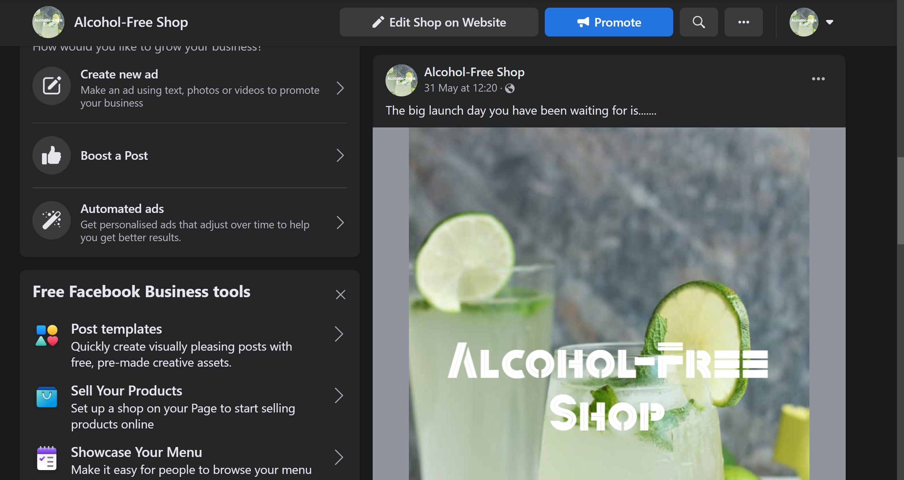
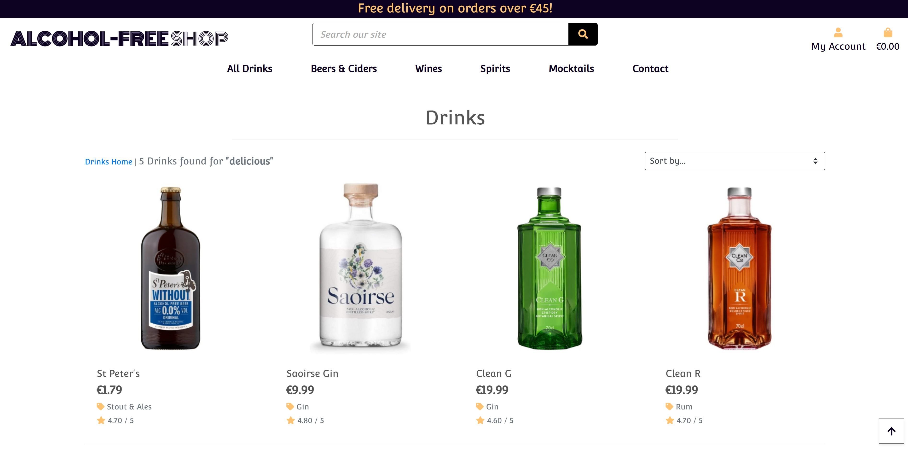

The project was tested thoroughly and the results are presented below:

## Table of contents:

 * [Validation](#validation)
    + [HTML](#html)
      - [W3C Markup Validation Service](#w3c-markup-validation-service)
    + [CSS](#css)
      - [W3C CSS Validation Service](#w3c-css-validation-service)
    + [JavaScript](#javascript)
      - [JSHint](#jshint)
    + [Python](#python)
    + [Lighthouse](#lighthouse)
      - [Desktop](#desktop)
      - [Mobile](#mobile)
  * [Testing of User stories & UX values](#testing-of-user-stories-&-ux-values)
      - [General](#general)
      - [Products](#products)
      - [Reviews](#reviews)
      - [Bag](#bag)
      - [Checkout](#checkout)
      - [Blog](#blog)
      - [Contact](#contact)
  * [Testing process](#testing-process)
    + [Manual Testing](#manual-testing)
      - [Navigation bar](#navigation-bar)
      - [Footer](#footer)
      - [Home](#home)
      - [Sign up page](#sign-up-page)
      - [Login page](#login-page)
      - [Logging out](#logging-out)
      - [Products](#products-1)
      - [Review Product](#review-product)
      - [Bag](#bag)
      - [Checkout](#checkout)
      - [Profile](#profile)
      - [Blog Management](#blog-management)
      - [Product Management](#product-management)
      - [Blog](#blog)
      - [Contact](#contact)
      - [Toasts](#toasts)
      - [CRUD Functionality](#crud-functionality)
      - [Responsiveness](#responsiveness)
      - [Browsers and devices](#browsers-and-devices)
      - [Stripe Testing](#stripe-testing)
      - [Defensive Programming](#defensive-programming)
    + [Bugs](#bugs)
      - [Fixed Bugs](#fixed-bugs)
      - [Known Bugs](#known-bugs)

## Validation

### HTML

#### W3C Markup Validation Service 

* [W3C Markup Validation Service](https://validator.w3.org/) was used to validate the HTML of the project. Each page was validated by its URL and produced no errors or warnings. When each HTML page was validated by direct input, all errors produced were due to templating.

### CSS

#### W3C CSS Validation Service

* [W3C CSS Validation Service](https://jigsaw.w3.org/css-validator/) was used to validate the CSS of the project. As well as showing no errors when validating the projects CSS through its URI, there was also no errors when each CSS file was validated through direct input.

### JavaScript

#### JSHint

* All JavaScript files or snippets of JavaScript at the bottom of HTML files were validated successfully through [JSHint](https://jshint.com/).
    

* The JavaScript files for handling the Stripe payment flow
    

### Python

* All Python files were validated through the use of [PEP8 online](http://pep8online.com/) and all passed successfully.

    

### Lighthouse

* Lighthouse was also used to test the project on both desktop and mobile.

#### Desktop

#### Mobile

## Testing of User stories & UX value

* Starting from an unregistered customer...

    #### General

    * *As a user I can I want to be clear what the site is for so that I can avoid wasting time if it does not offer me value*

        * On arrival of the website, the user is able to understand the purpose of the website. This is due to the use of imagery, logo, the homepage CTA and the navigation links available to the user to visit.

        

    * *As a shopper I can easily register for an account so that I have my own personal account to be able to view my profile*

        * 

        
    
    * *As a shopper I can follow on Facebook so that I can be up to date with announcements & share with my followers*

        * The

        

    * *As a shopper I can sign up for a newsletter so that I can avail of the discount & updates on new products etc*

        * The

        

    * *As a shopper I can have a personalized user profile so that I can view my personal order history and order confirmations and save my payment information*

        * 

        

    * *As a shopper I can receive an email confirmation after registering so that I can verify that my account registration was successful*

        * As the image below. For further details click about the process click [here](#sign-up-page)

        

    * *As a shopper I can easily recover my password in case I forget it so that I can access my personal account information*

        * By following the steps as per the images below. If you are getting a password error, click the link 'Forgot Password?'. 

        
        * Part 2 is to complete the following form & await an email to balidate resetting old password.
        

    * *As a shopper I can easily login or logout so that I can view my personal account & be able to access my profile*

        * As per the folowing images the process to login or logout two simple steps

        
        *  Sign out message to confirm
        
        *  Message confirming you have logged out. For further login details click [here](#login-page)
        

    ### Products

    * *As a shopper I can view individual drink details so that identify the price, category, description product rating, drink image, customer ratings & reviews*

        * As per the 1st below image all the product details displayed neatly for users to navigate at ease

        
        * Below image is where anybody can read the reviews of the users & see there ratings right under the review form.
        

    * *As a shopper I can easily select the drink & quantity I wish to purchase so that I can ensure I don't accidentally select the wrong product or quantity*

        * As per the quantity select in this 'ARRRR image below, the user can click the plus & minus buttons to confirm the quantity of each product. In this occasion where the pirate has purchased 16 bottle of Rumish.  

        

    * *As a shopper I can easily see what is available based on my search criteria and the number of results so that I can quickly decide whether the product I want is available*

        * 

        

    * *As a shopper I can search for a drink by name or description so that I can find a specific drink I would like to purchase*

        * 

        

    * *As a shopper I can sort a specific category of a drink so that I can find the best priced or best-rated product in a specific category*

        * 

        

    * *As a shopper I can sort the list of available drinks so that I can easily identify in alphabethical order of category or product name from a-z or z-a*

        * 

        

    ### Reviews
    * *As a user I can rate, rank, review & read reviews, so that I can inform others of my experience while learning from others experiences*

        * The

        

    ### Bag
     * *As a shopper I can adjust the quantity of individual items in my bag so that I can easily make changes to my purchase before checkout*

        * As per the image below the user may see the drinks currently in the shopping bag & make any informed changes before moving on to the checkout page

        

    * *As a shopper I can view items in shopping bag to be purchased so that I can identify the total cost of my purchase and all items I will receive, including delivery costs*

        * As per the below image the customer is given details of the costs when reaching the checkout page so that they make an informed decision before proceeding

        

    * *As a shopper I can easily view the total of my purchases at any time so that avoid spending too much*

        * As per the below image the user always has visible access to the current shopping bag total at the top right hand corner of the screen

        
    ### Checkout
    * *As a user I have my details stored in my profile account so that I no longer need to go through the procedure of entering my details when making a payment*

        * As per the image below when a user is logged in their details will automatically be inserted into the form at checkout time. 

        

    * *As a shopper I can receive an email confirmation after checking out so that I can keep the confirmation of what I have purchased for my records*

        * As per the image below the shopper will receive an email directly after purchasing to confirm details of successful transaction

        

    * *As a shopper I can view an order confirmation after checkout so that I can have peace of mind that I have not made any errors*

        * 

        

    * *As a shopper I can feel my personal and payment information is safe and secure so that I can confidently provide the needed information to make a purchase*

        * 

        

    * *As a shopper I can easily enter my payment information so that I can checkout quickly with no hassle*

        * 

        

    ### Blog
    * *As a user/non user I can view comments on an individual post so that I can read other peoples opinion*

        * 

        

    * *As a User I can view a list of posts so that I can select one to read based on the synopsis*

        * 

        

    * *As a user I can leave comments on a post so that I can be involved & express my view*

        * 

        

    ### Contact
    * *As a shopper I can contact the shop so that I can make a query in relation to the business or products etc*

        * 

        

## Testing process
## Manual Testing
The website was thoroughly tested as per the detailed account of the manual testing is below:

#### Navigation bar
* All navigation bar links were tested and worked correctly. &check;
* All dropdown menus appear correctly when their link has been clicked and all dropdown menu links take the user to the right page. i.e dropdown menus for categories take the user to the specific one selected. &check;
* The 'Alcohol-Free Shop' logo takes the user back to the home page as intended. &check;
* Below the bag icon, shows the total price of the current shopping bag and correctly changes price every time an item is added or removed. &check;
* The search bar works as expected, it returns a page of drinks if the user correctly matches something in the product database. &check;
* If a search query doesn't match a product on the site, the user is informed that '0 Products found for "*Query*". &check;
* If nothing is input, the user receives a toast advising they haven't 'entered any search criteria!'. &check;
* When the user hovers over any link of the Navbar the colour will change. &check;
* Just above the Navbar there is a notification highlighting free delivery when an order price is above a certain number. &check;
* The drop down account in the Navbar allows the users to sign in or logout at ease. &check;

#### Footer
* The Newsletter(by mailchimp) application is placed inside the footer so that the user can subscribe on all pages. It has been styled to match the footer & also for responsiveness. &check;
* All social media links take the user to the correct page and correctly open a new tab for the user to view them on. Specifically the linked Facebook page for Alcohol-Free Shop &check;
* A link to all the different products is supplied here underneath the heading Shop. &check;
* A link to login, contact, register or view All products is supplied here underneath the heading Company. &check;
* The colour design of the footer was created using linear-gradient in CSS. &check;

#### Home

* On entering Home Page you can view in the center of the page an enticing descriptive caption to explain in one sentence the value of the website. &check;
* The 'Shop Now' CTA button takes the user to the 'All Products' page as intended. &check;

* I was considering adding a card description of each page but I felt it would be unnecessary as there are already sufficient links for each page in the Nav bar and Footer. Plus Wine, Beer & Spirits do require much more descriptions.

#### Sign up page
* The user can sign up and create an account by clicking the 'Accounts' dropdown menu on the top right. When they click on 'Sign Up' they are taken to the correct page to register. &check;
* Each form field provides a message if they have not been filled in correctly. &check;
* A notification will appear if a user has already registered with the email address they are using. &check;
* A message saying username exists will appear if the user inputs one already taken. &check;
* A 'password is too short' message appears if the user doesn't fill it in correctly. &check;
* Password 'too common will also appear when necessary. &check;
* It will show Password is 'entirely numeric. &check;
* Email is successfully sent to user when taken to verification page. &check;
* The link in the email takes the user to a page in which they can confirm verification. &check;
* Once signed up successfully, the user is redirected to login page so they can sign in with new credentials. &check;
* The link that takes the user to the login page works as intended. &check;
* All Allauth buttons works as expected. &check;

#### Login page
* A message will appear advising the user that the 'Username and/or Password specified are not correct'. &check;
* The user can sign in with a username or email. &check;
* The link that takes the user to the sign up page works as intended. &check;
* The user can reset their password by clicking on 'Forgot Password?'. It takes them to a page where they input their email address. When the user clicks on the link, they are able to change password and are advised its been successfully reset. &check;
* The form fields alert the user if they haven't input anything into each field. &check;
* All Allauth buttons works as expected. &check;

#### Logging out

* When the user is logged in they can log out by going to the 'Accounts' dropdown menu and selecting 'Log Out'. It correctly takes them to the Log out page where the user can log out. &check;
* When the user confirms they are logging out, by clicking on the 'Sign Out' button it correctly signs them out of their account withh a messge confirming. &check;

### Products
##### Product page

* Each product takes the user to that specific products detail page. &check;
* The sort by select box options were all tested and ordered all the products correctly. &check;
* The number of products on the page presented next to the sort by select box always shows the correct amount of products currently on the page. &check;

##### Product Detail page

* When the user clicks on the product image, it opens a new tab for the user to view a full page image of the product as intended. &check;
* The quantity select box minus and plus buttons work correctly. i.e they decrease or increase quantity by 1 each time they are pressed. &check;
* The quantity will not go below 1 as intended and above 99 as intended. If the user tries to manually input a number out of this range, they aren't able to & the button colour will change to signify no action taken &check;
* The 'Add to bag' button works as expected and adds the item(s) to bag. &check;
* The price will appear underneath the name of the product with a euro sign beside it. &check;
* The category of the product is displayed with a golden tag beside it which can be clicked to see further products in this category. &check;
* The short description of the product is displayed so that the user can make an informed choice. This description was sourced by entering the product name followed by description into google &check;
* Underneath the main product detail of the website is a form for the user to make a [review](#reviews) & a rating &check;

#### Review Product
* When the user is logged in the submit button underneath the Review form will appear &check;
* If the user/non user is not logged in the button will no longer be there & will be replaced with the comment as per the image below. When the buttons either the signup/login buttons are clicked, the user/non user will be directed to the correct page to login or signup respectively &check;
    
* The user can rate the drink when making a review by clicking on the stars provided from one to five. When the user hovers over said stars they change to a yellow star colour. I was able to impliment this important element thanks to a youtube video tutorial by Rathan Kumar. This review is specified as a requirement to enter a comment &check;
* The user is only allowed one critical review & if they attempt to write a second review they well receive the following error message &check;
    
* When the user is logged in a button will appear under their reviews to give them the option to update or delete comments. This will only appear under the users comments unless they are a superuser who can update & delete all comments. &check;
    
* When the user clicks update review they will be taken to the update review page as per the image below. &check;
    
* When they have updated the review & clicked update they will get the folowing success message.&check;
    
* When the user clicks to delete their review they will be directed to the following delete review page to confirm deletion. &check;
    
* If they click delete they will get the following success message & if they click cancel they will return to the products page.&check;
    

* I am critical at times of likes on comments so I did not add this but I may add the option to reply in the future. Also when the user rates the product ideally it would update the current rating of the product via an average calculation.

#### Bag
* When no items have been added to the bag, the bag page shows a 'Continue Shopping' button which correctly takes the user to the 'All Products' page. &check;
* The bag page correctly shows all the items and the item specifics selected by the user and matches the bag toast shown every time a user adds something to the bag. &check;
* The user is able to change quantity of an item by clicking the minus and plus buttons. &check;
* The user cannot go below 1 or above 99 when selecting a quantity. &check;
* The update and remove links were as expected. When a quantity has been increased or decreased and the update link is clicked, the user is met with the new updated quantity and the price changes correctly too. &check;
* When the user clicks on the remove link, the item is removed successfully and the total bag price changes accordingly too. &check;
* Both bag page and the bag toast shows the free delivery message advising the user if they spend a certain amount, they'll receive free delivery. If the total price is above £50, the message doesn't appear correctly. &check;
* The 'Secure Checkout' button correctly takes the user to the Checkout page. &check;
* The 'Secure Checkout' button on the bag toast correctly takes the user to the bag page as intended. &check;
* The subtotal and grand total prices correctly change with compliance to any changes made to items. &check;

#### Checkout
* The checkout page shows the correct items in the bag. &check;
* If the user has added any delivery details to their profile and saved them, they are automatically filled in on the Checkout page. &check;
* The checkbox allowing the user to save their delivery information when they order their items works as intended. It doesn't save the information if left blank but does stay their the next time the user goes to their Profile page or goes to the Checkout page again. &check;
* If the user isn't logged in, two links to create or login to an account to save delivery information is shown and both links take the user to the right page. &check;
* All form fields with asterisks need to be filled in and the user is met with a message for each one if its not filled in or valid. &check;
* The country form field correctly shows all the countries the user can input and works when one is selected. &check;
* The 'Adjust bag' button takes the user back to the bag page as intended. &check;
* The card payment field shows a specific message if a card number is not entered correctly or the expiry date, security code or ZIP code is entered correctly either. &check;
* When every form field is valid and the user presses on the button 'Create Order', they are met with a loading screen and then taken to the Checkout Success page. &check;
* The Checkout Success page shows the order details to the user and they are saved in the order history of the users Profile page if a user ordered it signed in. &check;
* The user will also receive a checkout success message in the top right corner with the order number when checkout is successful &check;
* The user is also sent an email confirming their order and is given all the appropriate order information in the email too. &check;

#### Profile
* The Default delivery information can be edited and saved by pressing on the 'Update Information' button which saves it as intended and a toast appears saying the Profile is updated successfully. &check;
* The users order history also shows a list of all past orders and each order has a link to its order information on the order number which works correctly. &check;
* The can easily recover their password in case forgetten so that they can access their personal account information with previous order information &check;

#### Blog Management
* When entering the Blog page the Super user is the only one who can see & click the button which takes you to the blog page for creating & adding new blogs. &check;
* All form fields work as expected, the form fields which need something inputting in will inform the user if nothing has been added to them and stop them submitting. &check;
* The image field works successfully and adds a blog post image. If no image is given, the default one shows instead. &check;
* Edit buttons on both the Blog page and Blog Detail page take the superuser to the correct Edit blogpost page. &check;
* The Delete buttons both work on the Blog page and Blog Detail page, opening up a page requesting confirmation of the delete before proceeding. &check;
    
* The cancel button works correctly on the modal and so does the cross, cancelling the deletion. &check;
* The Delete button on the modal works successfully removing the blog post from the site and showing a toast, saying its been deleted successfully. &check;
* The 'Create Post' button works when all the form is valid on the add blog post page. &check;
* The 'Edit Post' button works when all the form is valid on the edit blog post page. &check;
* When a comment is made it needs to be approved by the admin before it will be published &check;

#### Product Management
* The user is correctly taken to the page where they can add a product when selecting 'Product Management' on the 'Accounts dropdown menu. &check;
* All form fields work as expected, the form fields which need something inputting in will inform the user if nothing has been added to them and stop them submitting. &check;
* The image field works successfully and adds a product image. If no image is given, the default one shows instead. &check;
* Edit buttons on both the Product page and Product Detail page take the user to the correct Edit product page. &check;
* The Delete buttons both work on the Product page and Product Detail page, imperatively opening up a page to confirm deletion. &check;
* The cancel button works correctly on the modal and so does the cross, cancelling the deletion. &check;
* The Delete button in the admin works successfully removing the product from the site and showing a toast, saying its been deleted successfully. &check;
* The 'Create Product' button works when all the form is valid on the add product page. &check;
* The 'Edit Product' button works when all the form is valid on the edit product page. &check;
* Admin can add new products in the browser & the admin at ease by clicking on the drop down menu My Acount to sourcce the Product Management.

#### Blog

##### Blog page

* The blog page shows a list of blogs added and can view a full specific blog post succesfully by clicking on the 'Read More' button. &check;
* It has a 'back to top* button with an arrow like the products page to redirect the user to the top at anytime. &check;
* The Blog page shows a synopsis of th the blog with the main image, date of publication along with the author &check;

##### Blog Detail page

* The blog detail page has an image at the top with the blog just below which is viewed on very a slight opacity of white background &check;
* When the user is logged in the submit button underneath the Blog form will appear &check;
* If the user/non user is not logged in the button will no longer be there & will be replaced with the comment as per the image below. When either of the login/signup buttons are clicked the user will be directed to the correct page to login or signup respectively &check;
    
* The user is allowed to comment more than once as the possible reply button has not been implimented(yet) &check;
* When the user is logged in a button will appear under their comment to give them the option to update or delete comments. This will only appear under the users comments unless they are a superuser who can update & delete all comments. &check;
* When the user clicks update comment they will be taken to the update comment page. &check;
* When they have updated the comment & clicked update they will get the folowing success message.&check;
    
* When the user clicks to delete their review they will be directed to the delete comment page to confirm deletion. &check;
* If they click delete they will get a success message & if they click cancel they will return to the products page.&check;

* I am critical at times of likes on comments so I did not add this but I may add the option to reply in the future.

#### Contact

* All form fields show a message if nothing is inputted into them or its content is not valid and stops the user submitting the form until it is valid. &check;
* A toast also appears on successful submission telling the user, 'Alcohol-Free Shop' will be in touch shortly. &check;
* You do not have to be a user to send a message to Alcohol-Free Shop via the contacts page 

#### Toasts

* The toasts appear correctly any time a relevant action has been taken. &check;
* The JavaScript used for the toast messages work as intended. &check;
* All information and links work as expected on the shopping bag toast. &check;

#### CRUD Functionality

* All CRUD functionality was tested and worked as expected. &check;

#### Responsiveness
* Responsiveness work was continually worked on, some areas including the incremental & decremental buttons may need more work with alignment to be more responsive particularly on the smallest phone sizes. The subjects comments can be cut off below 350 but this can be resolved in time.
#### Browsers and devices
* I have constantly done test on different browsers & sent to friends & family to do the same. I made some changes in particular in the css to resolve issues on many browser using linear-gradient(footer & subject) & opacity. I found some issues on my phone but when I do the phone test on my laptop it is working ok.  

* The website was tested on the following Desktop browsers:

    * Firefox
    * Google Chrome + Mobile
    * Microsoft Edge 
    * Brave + Mobile
    * Duck Duck Go(mobile)

#### Stripe Testing

* The Stripe functionality has been consistently tested with every new change and the result below shows the webhooks generated from a successful order.

    

#### Defensive Programming

* Error pages were tested and worked. &check;
* When a user inputs a URL that doesn't exist, it correctly returns a 404 error page. &check;
* If the user tries to enter a URL that does exist, like an add product page, edit product page or delete product URL but is not signed in as the superuser, it will just redirect the user to the login page. As per the below image: the user tried to enter the private page by enter it into the url & was directed back to the sign up page. When signed in as a user was informed the clear message as per below &check;
    
* A confirmation modal was added in the case of the superuser accidentally pressing the delete button. This gives the superuser chance to cancel the deletion in this instance. &check;
* The allauth sign up process hashes the users password in the admin panel. &check;
* As an extra security step, When the user signs up, they are required to verify their email. &check;
## Bugs
### Fixed Bugs
##### Bug 1
* My contact page would not open due to a programmable error for at least a few days. Every time I went back to it I would tweet the code a bit & run migrations. Nothing seemed to work so I decided to delete the migrations file & run migrations again. when this didn't work decided to delete all migration files in the tree & make migrations again. As this did not work I tried deleting the back on from a different angle to make sure all migrations we removed. Until I finally tried : python3 manage.py migrate contact zero, thanks to some fine guidance from the Tutor Sean.

##### Bug 2

### Known Bugs

    
