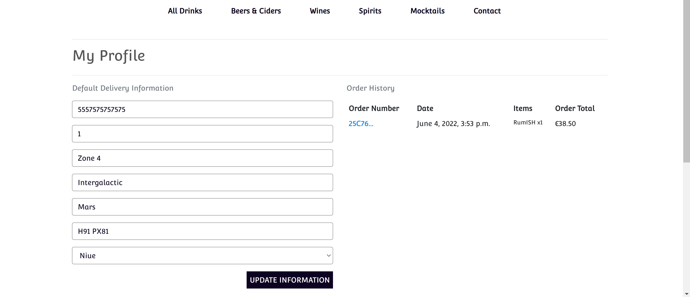
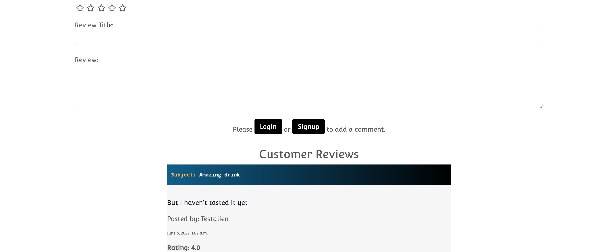

The project was tested thoroughly and the results are presented below:

## Table of contents:

 * [Validation](#validation)
    + [HTML](#html)
      - [W3C Markup Validation Service](#w3c-markup-validation-service)
    + [CSS](#css)
      - [W3C CSS Validation Service](#w3c-css-validation-service)
    + [JavaScript](#javascript)
      - [JSHint](#jshint)
    + [Python](#python)
    + [Lighthouse](#lighthouse)
      - [Desktop](#desktop)
      - [Mobile](#mobile)
  * [Testing of User stories & UX values](#testing-of-user-stories-&-ux-values)
      - [General](#general)
      - [Products](#products)
      - [Reviews](#reviews)
      - [Bag](#bag)
      - [Checkout](#checkout)
      - [Blog](#blog)
      - [Contact](#contact)
  * [Testing process](#testing-process)
    + [Manual Testing](#manual-testing)
      - [Navigation bar](#navigation-bar)
      - [Footer](#footer)
      - [Home](#home)
      - [Sign up page](#sign-up-page)
      - [Login page](#login-page)
      - [Logging out](#logging-out)
      - [Products](#products-1)
      - [Review Product](#review-product)
      - [Bag](#bag)
      - [Checkout](#checkout)
      - [Profile](#profile)
      - [Blog Management](#blog-management)
      - [Product Management](#product-management)
      - [Blog](#blog)
      - [Contact](#contact)
      - [Toasts](#toasts)
      - [CRUD Functionality](#crud-functionality)
      - [Responsiveness](#responsiveness)
      - [Browsers and devices](#browsers-and-devices)
      - [Stripe Testing](#stripe-testing)
      - [Defensive Programming](#defensive-programming)
    + [Bugs](#bugs)
      - [Fixed Bugs](#fixed-bugs)
      - [Known Bugs](#known-bugs)

## Validation

### HTML

#### W3C Markup Validation Service 

* [W3C Markup Validation Service](https://validator.w3.org/) was used to validate the HTML of the project. Each page was validated by its URL and produced no errors or warnings. When each HTML page was validated by direct input, all errors produced were due to templating.

### CSS

#### W3C CSS Validation Service

* [W3C CSS Validation Service](https://jigsaw.w3.org/css-validator/) was used to validate the CSS of the project. As well as showing no errors when validating the projects CSS through its URI, there was also no errors when each CSS file was validated through direct input.

### JavaScript

#### JSHint

* All JavaScript files or snippets of JavaScript at the bottom of HTML files were validated successfully through [JSHint](https://jshint.com/).

### Python

* All Python files were validated through the use of [PEP8 online](http://pep8online.com/) and all passed successfully.

* A Gitpod built-in linter called pylint was also used to fix bugs within the python code and provided many suggestions on how to improve the code. For instance it advised to place a docstring at the top of all the python files.

### Lighthouse

* Lighthouse was also used to test the project on both desktop and mobile.

#### Desktop

#### Mobile

## Testing of User stories & UX value

* Starting from an unregistered customer...

    #### General

    * *As a user I can I want to be clear what the site is for so that I can avoid wasting time if it does not offer me value*

        * On arrival of the website, the user is able to understand the purpose of the website. This is due to the use of imagery, logo, the homepage CTA and the navigation links available to the user to visit.

        

    * *As a shopper I can easily register for an account so that I have my own personal account to be able to view my profile*

        * 

        
    
    * *As a shopper I can follow on Facebook so that I can be up to date with announcements & share with my followers*

        * The

        

    * *As a shopper I can sign up for a newsletter so that I can avail of the discount & updates on new products etc*

        * The

        

    * *As a shopper I can have a personalized user profile so that I can view my personal order history and order confirmations and save my payment information*

        * 

        

    * *As a shopper I can receive an email confirmation after registering so that I can verify that my account registration was successful*

        * As the image below. For further details click about the process click [here](#sign-up-page)

        

    * *As a shopper I can easily recover my password in case I forget it so that I can access my personal account information*

        * By following the steps as per the images below. If you are getting a password error, click the link 'Forgot Password?'. 

        
        * Part 2 is to complete the following form & await an email to balidate resetting old password.
        

    * *As a shopper I can easily login or logout so that I can view my personal account & be able to access my profile*

        * As per the folowing images the process to login or logout two simple steps

        
        *  Sign out message to confirm
        
        *  Message confirming you have logged out. For further login details click [here](#login-page)
        

    ### Products

    * *As a shopper I can view individual drink details so that identify the price, category, description product rating, drink image, customer ratings & reviews*

        * As per the 1st below image all the product details displayed neatly for users to navigate at ease

        
        * Below image is where anybody can read the reviews of the users & see there ratings right under the review form.
        

    * *As a shopper I can easily select the drink & quantity I wish to purchase so that I can ensure I don't accidentally select the wrong product or quantity*

        * As per the quantity select in this 'ARRRR image below, the user can click the plus & minus buttons to confirm the quantity of each product. In this occasion where the pirate has purchased 16 bottle of Rumish.  

        

    * *As a shopper I can easily see what is available based on my search criteria and the number of results so that I can quickly decide whether the product I want is available*

        * 

        

    * *As a shopper I can search for a drink by name or description so that I can find a specific drink I would like to purchase*

        * 

        

    * *As a shopper I can sort a specific category of a drink so that I can find the best priced or best-rated product in a specific category*

        * 

        

    * *As a shopper I can sort the list of available drinks so that I can easily identify in alphabethical order of category or product name from a-z or z-a*

        * 

        

    ### Reviews
    * *As a user I can rate, rank, review & read reviews, so that I can inform others of my experience while learning from others experiences*

        * The

        

    ### Bag
     * *As a shopper I can adjust the quantity of individual items in my bag so that I can easily make changes to my purchase before checkout*

        * As per the image below the user may see the drinks currently in the shopping bag & make any informed changes before moving on to the checkout page

        

    * *As a shopper I can view items in shopping bag to be purchased so that I can identify the total cost of my purchase and all items I will receive, including delivery costs*

        * As per the below image the customer is given details of the costs when reaching the checkout page so that they make an informed decision before proceeding

        

    * *As a shopper I can easily view the total of my purchases at any time so that avoid spending too much*

        * As per the below image the user always has visible access to the current shopping bag total at the top right hand corner of the screen

        
    ### Checkout
    * *As a user I have my details stored in my profile account so that I no longer need to go through the procedure of entering my details when making a payment*

        * As per the image below when a user is logged in their details will automatically be inserted into the form at checkout time. 

        

    * *As a shopper I can receive an email confirmation after checking out so that I can keep the confirmation of what I have purchased for my records*

        * As per the image below the shopper will receive an email directly after purchasing to confirm details of successful transaction

        

    * *As a shopper I can view an order confirmation after checkout so that I can have peace of mind that I have not made any errors*

        * 

        

    * *As a shopper I can feel my personal and payment information is safe and secure so that I can confidently provide the needed information to make a purchase*

        * 

        

    * *As a shopper I can easily enter my payment information so that I can checkout quickly with no hassle*

        * 

        

    ### Blog
    * *As a user/non user I can view comments on an individual post so that I can read other peoples opinion*

        * 

        

    * *As a User I can view a list of posts so that I can select one to read based on the synopsis*

        * 

        

    * *As a user I can leave comments on a post so that I can be involved & express my view*

        * 

        

    ### Contact
    * *As a shopper I can contact the shop so that I can make a query in relation to the business or products etc*

        * 

        

## Testing process
## Manual Testing
The website was thoroughly tested as per the detailed account of the manual testing is below:

#### Navigation bar
* All navigation bar links were tested and worked correctly. &check;
* All dropdown menus appear correctly when their link has been clicked and all dropdown menu links take the user to the right page. i.e dropdown menus for categories take the user to the specific one selected. &check;
* The 'Alcohol-Free Shop' logo takes the user back to the home page as intended. &check;
* Below the bag icon, shows the total price of the current shopping bag and correctly changes price every time an item is added or removed. &check;
* The search bar works as expected, it returns a page of drinks if the user correctly matches something in the product database. &check;
* If a search query doesn't match a product on the site, the user is informed that '0 Products found for "*Query*". &check;
* If nothing is input, the user receives a toast advising they haven't 'entered any search criteria!'. &check;
* When the user hovers over any link of the Navbar the colour will change. &check;
* Just above the Navbar there is a notification highlighting free delivery when an order price is above a certain number. &check;
* The drop down account in the Navbar allows the users to sign in or logout at ease. &check;

#### Footer
* The Newsletter(by mailchimp) application is placed inside the footer so that the user can subscribe on all pages. It has been styled to match the footer & also for responsiveness. &check;
* All social media links take the user to the correct page and correctly open a new tab for the user to view them on. Specifically the linked Facebook page for Alcohol-Free Shop &check;
* A link to all the different products is supplied here underneath the heading Shop. &check;
* A link to login, contact, register or view All products is supplied here underneath the heading Company. &check;
* The colour design of the footer was created using linear-gradient in CSS. &check;

#### Home

* On entering Home Page you can view in the center of the page an enticing descriptive caption to explain in one sentence the value of the website. &check;
* The 'Shop Now' CTA button takes the user to the 'All Products' page as intended. &check;

* I was considering adding a card description of each page but I felt it would be unnecessary as there are already sufficient links for each page in the Nav bar and Footer. Plus Wine, Beer & Spirits do require much more descriptions.

#### Sign up page
* The user can sign up and create an account by clicking the 'Accounts' dropdown menu on the top right. When they click on 'Sign Up' they are taken to the correct page to register. &check;
* Each form field provides a message if they have not been filled in correctly. &check;
* A notification will appear if a user has already registered with the email address they are using. &check;
* A message saying username exists will appear if the user inputs one already taken. &check;
* A 'password is too short' message appears if the user doesn't fill it in correctly. &check;
* Password 'too common will also appear when necessary. &check;
* It will show Password is 'entirely numeric. &check;
* Email is successfully sent to user when taken to verification page. &check;
* The link in the email takes the user to a page in which they can confirm verification. &check;
* Once signed up successfully, the user is redirected to login page so they can sign in with new credentials. &check;
* The link that takes the user to the login page works as intended. &check;
* All Allauth buttons works as expected. &check;

#### Login page
* A message will appear advising the user that the 'Username and/or Password specified are not correct'. &check;
* The user can sign in with a username or email. &check;
* The link that takes the user to the sign up page works as intended. &check;
* The user can reset their password by clicking on 'Forgot Password?'. It takes them to a page where they input their email address. When the user clicks on the link, they are able to change password and are advised its been successfully reset. &check;
* The form fields alert the user if they haven't input anything into each field. &check;
* All Allauth buttons works as expected. &check;

#### Logging out

* When the user is logged in they can log out by going to the 'Accounts' dropdown menu and selecting 'Log Out'. It correctly takes them to the Log out page where the user can log out. &check;
* When the user confirms they are logging out, by clicking on the 'Sign Out' button it correctly signs them out of their account withh a messge confirming. &check;

### Products
##### Product page

* Each product takes the user to that specific products detail page. &check;
* The sort by select box options were all tested and ordered all the products correctly. &check;
* The number of products on the page presented next to the sort by select box always shows the correct amount of products currently on the page. &check;

##### Product Detail page

* When the user clicks on the product image, it opens a new tab for the user to view a full page image of the product as intended. &check;
* The quantity select box minus and plus buttons work correctly. i.e they decrease or increase quantity by 1 each time they are pressed. &check;
* The quantity will not go below 1 as intended and above 99 as intended. If the user tries to manually input a number out of this range, they aren't able to & the button colour will change to signify no action taken &check;
* The 'Add to Basket' button works as expected and adds the item(s) to basket. &check;
* The price will appear underneath the name of the product with a euro sign beside it. &check;
* The category of the product is displayed with a golden tag beside it which can be clicked to see further products in this category. &check;
* The short description of the product is displayed so that the user can make an informed choice. This description was sourced by entering the product name followed by description into google &check;
* Underneath the main product detail of the website is a form for the user to make a [review](#reviews) & a rating &check;

#### Review Product
* When the user is logged in the submit button underneath the Review form will appear &check;
* If the user/non user is not logged in the button will no longer be there & will be replaced with the comment in the image below. When the buttons are clicked to user/non user will be directed to the correct page to login or signup respectively &check;
    
* The user can rate the drink when making a review by clicking on the stars provided from one to five. When the user hovers over said stars they change to a yellow star colour. I was able to impliment this important element thanks to a youtube video tutorial by Rathan Kumar. This review is specified as a requirement to enter a comment
*

#### Bag

#### Checkout

#### Profile
    * *As a shopper I can easily recover my password in case I forget it so that I can access my personal account information*

        * 

        

    * *As a shopper I can easily login or logout so that have a personal account & be able to view my profile*

        * 

        

    * *As a shopper I can easily register for an account so that have a personal account to be able to view my profile*

        * 

        
#### Blog Management
* *As a site admin I can approve or disapprove comments so that I can filter out somewhat objectionable comments*
#### Product Management
    * *As an admin I can add a new drink so that I can allow customers a wider selection to choose from*

        * 

        
* *As a staff member I can get a notification if I edit or delete a product so that I can undo my error if I press delete by accident*

#### Blog

    * *As an admin I can delete a drink(product) so that I can remove items that are no longer for sale*

        * 

        

#### Contact

#### Toasts

#### CRUD Functionality

#### Responsiveness

#### Browsers and devices

#### Stripe Testing

#### Defensive Programming

## Bugs

### Fixed Bugs

### Known Bugs

    
